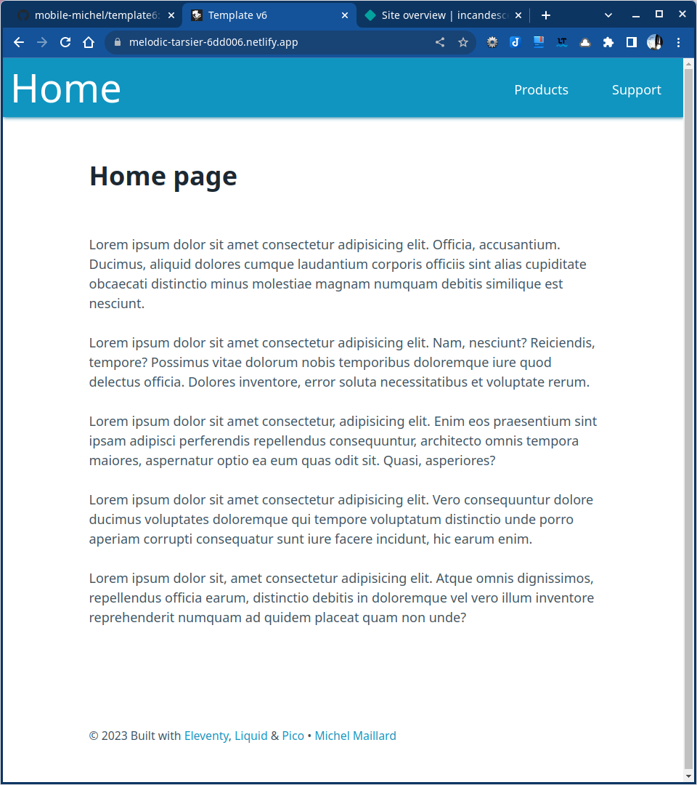

# Template 6

## Eleventy, Liquid, Pico with Sass processing & navbar

### Plugin: @11tyrocks/eleventy-plugin-sass-lightningcss

1. Installation
2. Layout with global data
3. Install Pico.css with SCSS files processing
4. Create two pages for primary level + 404 page
5. Navbar with stylesheet
6. Push to GitHub & deploy to Eleventy

